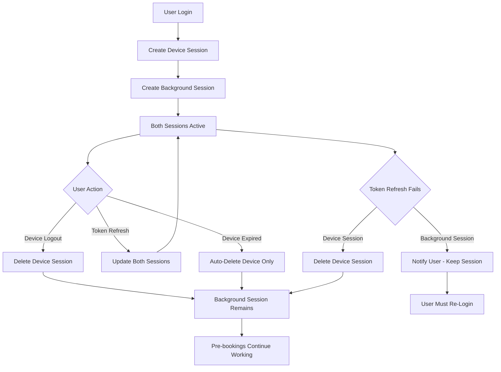

# Multi-Session Architecture Implementation Plan

**Feature ID:** multi-session-architecture
**Created:** 2025-10-17
**Architect:** nextjs-architect
**Status:** Ready for Implementation (REVISED)
**Last Updated:** 2025-10-17 (Critical fix applied)

---

## ⚠️ CRITICAL REVISION NOTICE

**Issue Identified:** The original design had a contradiction in the background fingerprint generation that would cause failures on re-login.

**Problem:**
- Fingerprint included timestamp → different fingerprint each login
- UPSERT by `(user_email, fingerprint)` → tries INSERT with new fingerprint
- Partial index blocks multiple background sessions → **INSERT fails**

**Solution Applied:**
- Removed timestamp from fingerprint generation (now deterministic)
- Each user gets SAME background fingerprint always
- UPSERT correctly updates existing session on re-login
- Partial index remains as safety validation

---

## Executive Summary

This document provides a comprehensive architectural plan for implementing multi-session support in the authentication system. The solution addresses the critical bug where background pre-bookings fail due to session deletion during token refresh, while enabling multiple device sessions per user.

**Key Innovation:** Separate background and device sessions with distinct fingerprints and lifecycle rules.

---

## 1. Database Schema Design

### 1.1 Recommended Schema Changes

**PRIMARY KEY DECISION:** Keep `id` as PRIMARY KEY, add UNIQUE constraint on `(user_email, fingerprint)`

**Rationale:**
- `id UUID` maintains referential integrity for foreign keys (future features)
- UNIQUE constraint on `(user_email, fingerprint)` enforces business rule
- Simplifies ORM/query patterns (single PK lookups)
- Better for audit logs and tracking (immutable ID)

### 1.2 Complete Schema Definition

```sql
-- Migration: 007_multi_session_architecture.sql

-- STEP 1: Add new columns
ALTER TABLE auth_sessions
  DROP CONSTRAINT IF EXISTS auth_sessions_user_email_key,
  ADD COLUMN IF NOT EXISTS session_type VARCHAR(20) NOT NULL DEFAULT 'device'
    CHECK (session_type IN ('background', 'device')),
  ADD COLUMN IF NOT EXISTS protected BOOLEAN NOT NULL DEFAULT false;

-- STEP 2: Make fingerprint required (was nullable)
ALTER TABLE auth_sessions
  ALTER COLUMN fingerprint SET NOT NULL;

-- STEP 3: Add composite unique constraint
ALTER TABLE auth_sessions
  ADD CONSTRAINT auth_sessions_email_fingerprint_unique
    UNIQUE (user_email, fingerprint);

-- STEP 4: Add unique constraint for background sessions
-- Each user can only have ONE background session
CREATE UNIQUE INDEX idx_auth_sessions_background_unique
  ON auth_sessions (user_email)
  WHERE session_type = 'background';

-- STEP 5: Update indexes for optimal query performance
DROP INDEX IF EXISTS idx_auth_sessions_email;

-- Index for querying sessions by email and type
CREATE INDEX idx_auth_sessions_email_type
  ON auth_sessions (user_email, session_type);

-- Index for background session lookups (most common query)
CREATE INDEX idx_auth_sessions_background
  ON auth_sessions (user_email, session_type)
  WHERE session_type = 'background';

-- Index for device session lookups
CREATE INDEX idx_auth_sessions_device
  ON auth_sessions (user_email, session_type)
  WHERE session_type = 'device';

-- Index for protected sessions (prevent accidental deletion)
CREATE INDEX idx_auth_sessions_protected
  ON auth_sessions (protected)
  WHERE protected = true;

-- Index for cleanup queries (only device sessions)
CREATE INDEX idx_auth_sessions_cleanup
  ON auth_sessions (created_at, session_type)
  WHERE session_type = 'device';

-- STEP 6: Update cleanup function to ONLY delete device sessions
CREATE OR REPLACE FUNCTION cleanup_expired_sessions()
RETURNS void AS $$
BEGIN
  -- CRITICAL: Only delete device sessions, NEVER background sessions
  DELETE FROM auth_sessions
  WHERE session_type = 'device'
    AND created_at < NOW() - INTERVAL '7 days';
END;
$$ LANGUAGE plpgsql;

-- STEP 7: Add comments
COMMENT ON COLUMN auth_sessions.session_type IS 'Type of session: background (for cron jobs) or device (for user devices)';
COMMENT ON COLUMN auth_sessions.protected IS 'If true, session cannot be deleted automatically (safety flag for background sessions)';
COMMENT ON INDEX idx_auth_sessions_background_unique IS 'Ensures each user has only ONE background session';
COMMENT ON FUNCTION cleanup_expired_sessions IS 'Cleans up ONLY device sessions older than 7 days. Background sessions are never deleted.';
```

### 1.3 Schema Design Rationale

| Decision | Rationale |
|----------|-----------|
| **Keep `id` as PK** | Maintains flexibility for foreign keys, audit trails, and referential integrity |
| **UNIQUE on `(email, fingerprint)`** | Enforces business rule: one fingerprint per email |
| **`session_type` ENUM** | Clear intent, database-level validation, better than boolean flags |
| **`protected` boolean** | Additional safety layer, can prevent accidental deletion via application code |
| **Partial index on background** | Ensures ONE background session per user |
| **Separate cleanup index** | Optimizes cleanup query to only scan device sessions |

---

## 2. Session Management Strategy

### 2.1 Session Type Rules

| Session Type | Fingerprint | TTL | Auto-Delete | Usage |
|-------------|-------------|-----|-------------|-------|
| **Background** | `bg-{hash}` | NEVER expires | NEVER | Pre-bookings, cron jobs |
| **Device** | Client-generated | 7 days | YES | UI interactions, user sessions |

### 2.2 Background Session Protection

**Multi-Layer Protection:**

1. **Database Level:**
   - `session_type = 'background'` field
   - `protected = true` flag (redundant safety)
   - Unique index prevents multiple background sessions
   - Cleanup function excludes `session_type = 'background'`

2. **Application Level:**
   - Service layer validates session type before deletion
   - Cron job explicitly filters by `session_type`
   - Delete methods require explicit confirmation for background sessions

3. **Query Patterns:**

```typescript
// CORRECT: Get background session
const session = await getSession(email, { sessionType: 'background' });

// CORRECT: Get device session by fingerprint
const session = await getSession(email, { fingerprint: deviceFingerprint });

// CORRECT: Delete device session
await deleteSession(email, { fingerprint: deviceFingerprint });

// PROTECTED: Background deletion requires explicit flag
await deleteSession(email, {
  sessionType: 'background',
  confirmProtectedDeletion: true
});
```

### 2.3 Session Lifecycle



---

## 3. Background Fingerprint Generation

### 3.1 Recommended Algorithm

```typescript
/**
 * Generates a secure, DETERMINISTIC background session fingerprint
 *
 * Format: bg-{40-character-hex-hash}
 * Total length: 43 characters
 *
 * CRITICAL: This MUST be deterministic (same email = same fingerprint)
 * to ensure only ONE background session per user.
 *
 * Uses Web Crypto API for cryptographic security
 */
export async function generateBackgroundFingerprint(email: string): Promise<string> {
  const salt = process.env.BACKGROUND_FINGERPRINT_SALT || 'aimharder-background-v1';

  // CRITICAL: NO timestamp - must be deterministic
  // Same email always generates same fingerprint
  const data = `${email.toLowerCase().trim()}-${salt}`;

  // Use Web Crypto API for secure hashing
  const encoder = new TextEncoder();
  const dataBuffer = encoder.encode(data);

  // SHA-256 hash (produces 32 bytes = 64 hex characters)
  const hashBuffer = await crypto.subtle.digest('SHA-256', dataBuffer);

  // Convert to hex string
  const hashArray = Array.from(new Uint8Array(hashBuffer));
  const hashHex = hashArray.map(b => b.toString(16).padStart(2, '0')).join('');

  // Take first 40 characters and prefix with 'bg-'
  return `bg-${hashHex.substring(0, 40)}`;
}

/**
 * Server-side version for Node.js (uses crypto module)
 * CRITICAL: DETERMINISTIC - no timestamp included
 */
export function generateBackgroundFingerprintSync(email: string): string {
  const crypto = require('crypto');
  const salt = process.env.BACKGROUND_FINGERPRINT_SALT || 'aimharder-background-v1';

  // CRITICAL: NO timestamp - must be deterministic
  const data = `${email.toLowerCase().trim()}-${salt}`;
  const hash = crypto.createHash('sha256').update(data).digest('hex');

  return `bg-${hash.substring(0, 40)}`;
}
```

### 3.2 Fingerprint Design Decisions (REVISED)

| Aspect | Decision | Rationale |
|--------|----------|-----------|
| **Prefix** | `bg-` | Instantly identifiable, prevents collision with device fingerprints |
| **Length** | 43 chars (bg- + 40 hex) | Sufficient entropy, database-friendly, URL-safe |
| **Algorithm** | SHA-256 | Industry standard, cryptographically secure, consistent output |
| **Input** | email + salt (NO timestamp) | **DETERMINISTIC** - same email = same fingerprint |
| **Salt** | Environment variable | Server-side secret, prevents rainbow table attacks |
| **Timestamp** | ~~Unix milliseconds~~ **NOT INCLUDED** | **REMOVED** - would create different fingerprint each login, breaking UPSERT |

### 3.3 Security Considerations (REVISED)

**Strengths:**
- Cryptographically secure hash function (SHA-256)
- Server-side generation (client cannot forge)
- Salt prevents predictability and rainbow table attacks
- Deterministic but still secure (can't reverse hash to get email)

**Trade-offs:**
- **Deterministic** (same email = same fingerprint)
- ✅ **Acceptable because:**
  - Background fingerprint is server-controlled, not user-facing
  - REQUIRED for UPSERT to work correctly on re-login
  - ONE background session per user (design requirement)
  - Partial index provides additional validation

**Why Timestamp Was Removed:**
```typescript
// ❌ WRONG: Would create NEW fingerprint each login
const data = `${email}-${timestamp}-${salt}`;  // Different every time!
// Problem: UPSERT tries INSERT with new fingerprint
// Result: Partial index blocks it → LOGIN FAILS

// ✅ CORRECT: Same fingerprint every time
const data = `${email}-${salt}`;  // Deterministic
// Result: UPSERT updates existing session → LOGIN SUCCEEDS
```

**Alternative Considered (Random):**
```typescript
// NOT RECOMMENDED: Pure random without traceability
export function generateBackgroundFingerprintRandom(): string {
  return `bg-${crypto.randomUUID().replace(/-/g, '')}`;
}
// Rejected because:
// - No traceability, harder to debug
// - Would create multiple background sessions per user
// - Defeats purpose of deterministic fingerprint
```

---

## 4. Service Layer Architecture

### 4.1 Updated TypeScript Interfaces

```typescript
// Session Types
export type SessionType = 'background' | 'device';

export interface SessionData {
  email: string;
  token: string;
  cookies: AuthCookie[];
  fingerprint: string; // NOW REQUIRED
  sessionType: SessionType; // NEW
  protected?: boolean; // NEW
  tokenData?: TokenData;
  createdAt: string;
  updatedAt?: string;
  lastRefreshDate?: string;
  refreshCount?: number;
  lastRefreshError?: string;
  autoRefreshEnabled?: boolean;
  lastTokenUpdateDate?: string;
  tokenUpdateCount?: number;
  lastTokenUpdateError?: string;
  isAdmin?: boolean;
}

export interface SessionRow {
  id: string;
  user_email: string;
  aimharder_token: string;
  aimharder_cookies: Array<{ name: string; value: string }>;
  fingerprint: string; // NOW REQUIRED
  session_type: SessionType; // NEW
  protected: boolean; // NEW
  created_at: string;
  updated_at: string;
  last_refresh_date?: string;
  refresh_count?: number;
  last_refresh_error?: string;
  auto_refresh_enabled?: boolean;
  last_token_update_date?: string;
  token_update_count?: number;
  last_token_update_error?: string;
  is_admin?: boolean;
}

// Query Options
export interface SessionQueryOptions {
  fingerprint?: string;
  sessionType?: SessionType;
}

export interface SessionDeleteOptions {
  fingerprint?: string;
  sessionType?: SessionType;
  confirmProtectedDeletion?: boolean; // Required for background session deletion
}
```

### 4.2 Service Layer Methods

```typescript
export class SupabaseSessionService {
  /**
   * Store a new session (INSERT or UPDATE)
   * Handles both background and device sessions
   */
  static async storeSession(sessionData: SessionData): Promise<void> {
    try {
      const { error } = await supabaseAdmin.from("auth_sessions").upsert(
        {
          user_email: sessionData.email,
          aimharder_token: sessionData.token,
          aimharder_cookies: sessionData.cookies.map((c) => ({
            name: c.name,
            value: c.value,
          })),
          fingerprint: sessionData.fingerprint,
          session_type: sessionData.sessionType,
          protected: sessionData.sessionType === 'background', // Auto-protect background
          created_at: sessionData.createdAt,
          updated_at: new Date().toISOString(),
        },
        {
          onConflict: "user_email,fingerprint", // UPDATED
        }
      );

      if (error) {
        console.error("Session storage error:", error);
        throw new Error(`Failed to store session: ${error.message}`);
      }
    } catch (error) {
      console.error("Session storage error:", error);
      throw error;
    }
  }

  /**
   * Get session with flexible query options
   *
   * Examples:
   * - getSession(email) → Returns background session (default for backward compatibility)
   * - getSession(email, { sessionType: 'background' }) → Explicit background
   * - getSession(email, { fingerprint: 'abc123' }) → Specific device session
   * - getSession(email, { sessionType: 'device' }) → Any device session (first found)
   */
  static async getSession(
    email: string,
    options: SessionQueryOptions = {}
  ): Promise<SessionData | null> {
    try {
      let query = supabaseAdmin
        .from("auth_sessions")
        .select("*")
        .eq("user_email", email);

      // Default behavior: return background session if no options provided
      if (!options.fingerprint && !options.sessionType) {
        query = query.eq("session_type", "background");
      }

      // Filter by fingerprint if provided
      if (options.fingerprint) {
        query = query.eq("fingerprint", options.fingerprint);
      }

      // Filter by session type if provided
      if (options.sessionType) {
        query = query.eq("session_type", options.sessionType);
      }

      const { data, error } = await query.single();

      if (error) {
        if (error.code === "PGRST116") {
          return null;
        }
        console.error("Session retrieval error:", error);
        throw new Error(`Failed to retrieve session: ${error.message}`);
      }

      if (!data) return null;

      return this.mapSessionRow(data as SessionRow);
    } catch (error) {
      console.error("Session retrieval error:", error);
      return null;
    }
  }

  /**
   * Get background session specifically (convenience method)
   */
  static async getBackgroundSession(email: string): Promise<SessionData | null> {
    return this.getSession(email, { sessionType: 'background' });
  }

  /**
   * Get all device sessions for a user
   */
  static async getDeviceSessions(email: string): Promise<SessionData[]> {
    try {
      const { data, error } = await supabaseAdmin
        .from("auth_sessions")
        .select("*")
        .eq("user_email", email)
        .eq("session_type", "device");

      if (error) {
        console.error("Device sessions retrieval error:", error);
        throw new Error(`Failed to retrieve device sessions: ${error.message}`);
      }

      return (data as SessionRow[]).map(row => this.mapSessionRow(row));
    } catch (error) {
      console.error("Device sessions retrieval error:", error);
      return [];
    }
  }

  /**
   * Delete session with protection for background sessions
   */
  static async deleteSession(
    email: string,
    options: SessionDeleteOptions = {}
  ): Promise<void> {
    try {
      // Build delete query
      let query = supabaseAdmin
        .from("auth_sessions")
        .delete()
        .eq("user_email", email);

      // PROTECTION: Prevent accidental background session deletion
      if (options.sessionType === 'background') {
        if (!options.confirmProtectedDeletion) {
          throw new Error(
            "Background session deletion requires explicit confirmation. " +
            "Set confirmProtectedDeletion: true to proceed."
          );
        }
        console.warn(`Deleting protected background session for ${email}`);
      }

      // If fingerprint provided, delete specific session
      if (options.fingerprint) {
        query = query.eq("fingerprint", options.fingerprint);
      }

      // If session type provided, filter by type
      if (options.sessionType) {
        query = query.eq("session_type", options.sessionType);
      }

      // SAFETY: If no filters, only delete device sessions
      if (!options.fingerprint && !options.sessionType) {
        console.log(`No specific filters - defaulting to device session deletion for ${email}`);
        query = query.eq("session_type", "device");
      }

      const { error } = await query;

      if (error) {
        console.error("Session deletion error:", error);
        throw new Error(`Failed to delete session: ${error.message}`);
      }
    } catch (error) {
      console.error("Session deletion error:", error);
      throw error;
    }
  }

  /**
   * Get all active sessions (both types) for cron processing
   */
  static async getAllActiveSessions(): Promise<SessionData[]> {
    try {
      const oneWeekAgo = new Date();
      oneWeekAgo.setDate(oneWeekAgo.getDate() - 7);

      const { data, error } = await supabaseAdmin
        .from("auth_sessions")
        .select("*")
        .or(
          // Background sessions: never expire
          `session_type.eq.background,` +
          // Device sessions: expire after 7 days
          `and(session_type.eq.device,created_at.gte.${oneWeekAgo.toISOString()})`
        );

      if (error) {
        console.error("Active sessions retrieval error:", error);
        throw new Error(`Failed to retrieve active sessions: ${error.message}`);
      }

      return (data as SessionRow[]).map(row => this.mapSessionRow(row));
    } catch (error) {
      console.error("Active sessions retrieval error:", error);
      return [];
    }
  }

  /**
   * Cleanup expired DEVICE sessions only
   */
  static async cleanupExpiredSessions(): Promise<number> {
    try {
      const oneWeekAgo = new Date();
      oneWeekAgo.setDate(oneWeekAgo.getDate() - 7);

      const { data, error } = await supabaseAdmin
        .from("auth_sessions")
        .delete()
        .eq("session_type", "device") // CRITICAL: Only device sessions
        .lt("created_at", oneWeekAgo.toISOString())
        .select("id");

      if (error) {
        console.error("Session cleanup error:", error);
        throw new Error(`Failed to cleanup expired sessions: ${error.message}`);
      }

      const cleanedCount = data?.length || 0;
      console.log(`Cleaned up ${cleanedCount} expired device sessions`);

      return cleanedCount;
    } catch (error) {
      console.error("Session cleanup error:", error);
      return 0;
    }
  }

  /**
   * Map database row to SessionData
   */
  private static mapSessionRow(row: SessionRow): SessionData {
    return {
      email: row.user_email,
      token: row.aimharder_token,
      cookies: row.aimharder_cookies.map((c) => ({
        name: c.name,
        value: c.value,
      })),
      fingerprint: row.fingerprint,
      sessionType: row.session_type,
      protected: row.protected,
      createdAt: row.created_at,
      updatedAt: row.updated_at,
      lastRefreshDate: row.last_refresh_date,
      refreshCount: row.refresh_count,
      lastRefreshError: row.last_refresh_error,
      autoRefreshEnabled: row.auto_refresh_enabled,
      lastTokenUpdateDate: row.last_token_update_date,
      tokenUpdateCount: row.token_update_count,
      lastTokenUpdateError: row.last_token_update_error,
      isAdmin: row.is_admin || false,
    };
  }
}
```

### 4.3 Service Design Rationale

| Design Choice | Rationale |
|---------------|-----------|
| **Unified `getSession()` with options** | Single method, flexible behavior, backward compatible |
| **Default to background session** | Pre-bookings and cron jobs expect background by default |
| **Convenience methods** | `getBackgroundSession()`, `getDeviceSessions()` for readability |
| **Protected deletion** | Requires explicit confirmation for background sessions |
| **Query filtering** | Explicit session type filtering prevents accidental operations |
| **Mapper pattern** | Centralizes row-to-model transformation |

---

## 5. Critical Bug Fix: Cron Job

### 5.1 Current Bug (Lines 84-89)

```typescript
// CURRENT CODE - DELETES ALL SESSIONS
if (updateResult.logout) {
  await SupabaseSessionService.deleteSession(session.email); // ❌ BUG
  results.failed++;
  results.errors.push(`${session.email}: Session expired`);
  continue;
}
```

### 5.2 Fixed Implementation

```typescript
// FIXED CODE - ONLY DELETE DEVICE SESSIONS
if (updateResult.logout) {
  // CRITICAL FIX: Only delete device sessions, NEVER background sessions
  if (session.sessionType === 'device') {
    console.log(`[Cron] Deleting expired device session for ${session.email} (fingerprint: ${session.fingerprint})`);
    await SupabaseSessionService.deleteSession(session.email, {
      fingerprint: session.fingerprint,
      sessionType: 'device'
    });
    results.deviceSessionsDeleted++;
  } else if (session.sessionType === 'background') {
    // Background session expired - CRITICAL ERROR
    console.error(`[Cron] ⚠️ CRITICAL: Background session expired for ${session.email}`);

    // TODO: Send notification to user (email, push notification, etc.)
    // User MUST re-login to restore background session
    await notifyUserBackgroundSessionExpired(session.email);

    // Mark session as needing re-authentication but DON'T delete
    await SupabaseSessionService.updateSession(session.email, {
      lastRefreshError: 'Background session expired - user must re-login',
      autoRefreshEnabled: false // Disable auto-refresh to prevent spam
    });

    results.backgroundSessionsFailed++;
  }

  results.failed++;
  results.errors.push(`${session.email}: Session expired (${session.sessionType})`);
  continue;
}
```

### 5.3 Updated Cron Job Flow

```typescript
// app/api/cron/refresh-tokens/route.ts

interface RefreshResults {
  total: number;
  updated: number;
  skipped: number;
  failed: number;
  deviceSessionsDeleted: number; // NEW
  backgroundSessionsFailed: number; // NEW
  errors: string[];
}

async function processTokenRefreshInBackground() {
  const startTime = Date.now();

  try {
    // Get all active sessions (background + device)
    const sessions = await SupabaseSessionService.getAllActiveSessions();

    const results: RefreshResults = {
      total: sessions.length,
      updated: 0,
      skipped: 0,
      failed: 0,
      deviceSessionsDeleted: 0,
      backgroundSessionsFailed: 0,
      errors: [],
    };

    // Process each session
    for (const session of sessions) {
      try {
        // Check if session needs update
        const updatedAt = new Date(session.updatedAt || session.createdAt);
        const now = new Date();
        const minutesSinceUpdate = (now.getTime() - updatedAt.getTime()) / (1000 * 60);

        if (minutesSinceUpdate <= 30) {
          results.skipped++;
          continue;
        }

        console.log(`[Cron] Refreshing ${session.sessionType} session for ${session.email}`);

        // Call Aimharder tokenUpdate
        const updateResult = await AimharderRefreshService.updateToken({
          token: session.token,
          fingerprint: session.fingerprint,
          cookies: session.cookies,
        });

        // CRITICAL FIX: Handle logout based on session type
        if (updateResult.logout) {
          if (session.sessionType === 'device') {
            console.log(`[Cron] Deleting expired device session for ${session.email}`);
            await SupabaseSessionService.deleteSession(session.email, {
              fingerprint: session.fingerprint,
              sessionType: 'device'
            });
            results.deviceSessionsDeleted++;
          } else if (session.sessionType === 'background') {
            console.error(`[Cron] ⚠️ CRITICAL: Background session expired for ${session.email}`);

            // Notify user
            await notifyUserBackgroundSessionExpired(session.email);

            // Disable auto-refresh but keep session
            await SupabaseSessionService.updateSession(session.email, {
              lastRefreshError: 'Background session expired - user must re-login',
              autoRefreshEnabled: false
            });

            results.backgroundSessionsFailed++;
          }

          results.failed++;
          results.errors.push(`${session.email}: Session expired (${session.sessionType})`);
          continue;
        }

        // Handle error
        if (!updateResult.success || !updateResult.newToken) {
          console.error(`[Cron] Failed to update token for ${session.email}:`, updateResult.error);

          await SupabaseSessionService.updateTokenUpdateData(
            session.email,
            false,
            updateResult.error
          );

          results.failed++;
          results.errors.push(`${session.email} (${session.sessionType}): ${updateResult.error}`);
          continue;
        }

        // Update DB with new token and cookies
        await SupabaseSessionService.updateRefreshToken(
          session.email,
          updateResult.newToken,
          session.fingerprint
        );

        if (updateResult.cookies && updateResult.cookies.length > 0) {
          await SupabaseSessionService.updateCookies(
            session.email,
            updateResult.cookies,
            session.fingerprint // NEW: Update specific session
          );
        }

        // Track successful token update
        await SupabaseSessionService.updateTokenUpdateData(
          session.email,
          true,
          undefined,
          session.fingerprint // NEW: Track per session
        );

        results.updated++;
      } catch (error) {
        console.error(`[Cron] Error processing session ${session.email}:`, error);
        results.failed++;
        results.errors.push(
          `${session.email} (${session.sessionType}): ${
            error instanceof Error ? error.message : "Unknown error"
          }`
        );
      }
    }

    const totalTime = Date.now() - startTime;
    console.log(`[Cron] Token refresh completed in ${totalTime}ms:`, results);
  } catch (error) {
    const totalTime = Date.now() - startTime;
    console.error(`[Cron] Token refresh failed after ${totalTime}ms:`, error);
  }
}

/**
 * Notify user that background session expired
 * TODO: Implement notification mechanism (email, push, etc.)
 */
async function notifyUserBackgroundSessionExpired(email: string): Promise<void> {
  console.log(`[Notification] Background session expired for ${email}`);
  // TODO: Send email notification
  // TODO: Create in-app notification
  // TODO: Log to monitoring system
}
```

---

## 6. Authentication Flow Changes

### 6.1 Login Endpoint Updates

```typescript
// app/api/auth/aimharder/route.ts

export async function POST(request: NextRequest) {
  try {
    const { email, password, fingerprint } = await request.json();

    // Validation (existing code)
    if (!email || !password) {
      return NextResponse.json(
        { success: false, error: 'Email and password are required' },
        { status: 400 }
      );
    }

    // Generate device fingerprint (client-provided or fallback)
    const deviceFingerprint = fingerprint || generateFingerprint();

    // Generate background fingerprint (server-side)
    const backgroundFingerprint = generateBackgroundFingerprintSync(email);

    console.log(`[Login] Creating sessions for ${email}:`, {
      deviceFingerprint,
      backgroundFingerprint
    });

    // PHASE 1: Login with DEVICE fingerprint
    const deviceLoginResult = await AimharderAuthService.login(
      email,
      password,
      deviceFingerprint
    );

    if (!deviceLoginResult.success) {
      return NextResponse.json(
        {
          success: false,
          error: deviceLoginResult.error || 'Authentication failed',
          remainingAttempts: AimharderAuthService.getRemainingAttempts(email) - 1
        },
        { status: 401 }
      );
    }

    // PHASE 2: Login with BACKGROUND fingerprint
    const backgroundLoginResult = await AimharderAuthService.login(
      email,
      password,
      backgroundFingerprint
    );

    // If background login fails, warn but continue (device session still works)
    if (!backgroundLoginResult.success) {
      console.warn(`[Login] Background session creation failed for ${email}:`, backgroundLoginResult.error);
      // Continue with device session only
    }

    // Store device session
    await SupabaseSessionService.storeSession({
      email,
      token: deviceLoginResult.data!.token,
      cookies: deviceLoginResult.cookies!,
      fingerprint: deviceFingerprint,
      sessionType: 'device',
      createdAt: new Date().toISOString(),
    });

    // Store background session (if successful)
    if (backgroundLoginResult.success && backgroundLoginResult.cookies) {
      await SupabaseSessionService.storeSession({
        email,
        token: backgroundLoginResult.data!.token,
        cookies: backgroundLoginResult.cookies,
        fingerprint: backgroundFingerprint,
        sessionType: 'background',
        protected: true,
        createdAt: new Date().toISOString(),
      });
    }

    // Create response with device session cookies
    const response = NextResponse.json({
      success: true,
      data: deviceLoginResult.data,
      aimharderSession: true,
      aimharderToken: deviceLoginResult.data!.token,
      cookies: deviceLoginResult.cookies,
      backgroundSessionCreated: backgroundLoginResult.success,
    });

    // Set device session cookies in browser
    deviceLoginResult.cookies!.forEach(cookie => {
      response.cookies.set(cookie.name, cookie.value, {
        httpOnly: true,
        secure: process.env.NODE_ENV === 'production',
        sameSite: 'lax',
        maxAge: 60 * 60 * 24 * 7,
        path: '/'
      });
    });

    response.cookies.set('aimharder-auth', 'true', {
      httpOnly: false,
      secure: process.env.NODE_ENV === 'production',
      sameSite: 'lax',
      maxAge: 60 * 60 * 24 * 7,
      path: '/'
    });

    console.log(`[Login] Success for ${email}:`, {
      deviceSession: true,
      backgroundSession: backgroundLoginResult.success
    });

    return response;
  } catch (error) {
    console.error('Authentication API error:', error);
    return NextResponse.json(
      {
        success: false,
        error: 'Internal server error during authentication'
      },
      { status: 500 }
    );
  }
}
```

### 6.2 Logout Endpoint Updates

```typescript
// app/api/auth/aimharder/route.ts (DELETE method)

export async function DELETE(request: NextRequest) {
  try {
    const { email, fingerprint } = await request.json();

    if (!email) {
      return NextResponse.json(
        { success: false, error: 'Email is required for logout' },
        { status: 400 }
      );
    }

    // CRITICAL: Only delete device session with specific fingerprint
    if (fingerprint) {
      console.log(`[Logout] Deleting device session for ${email} (fingerprint: ${fingerprint})`);
      await SupabaseSessionService.deleteSession(email, {
        fingerprint,
        sessionType: 'device'
      });
    } else {
      // No fingerprint provided - delete all device sessions
      console.log(`[Logout] Deleting all device sessions for ${email}`);
      await SupabaseSessionService.deleteSession(email, {
        sessionType: 'device'
      });
    }

    // Create response and clear cookies
    const response = NextResponse.json({
      success: true,
      message: 'Device session cleared. Background session remains active for pre-bookings.'
    });

    // Clear all aimharder-related cookies
    const cookiesToClear = ['AWSALB', 'AWSALBCORS', 'PHPSESSID', 'amhrdrauth', 'aimharder-auth'];

    cookiesToClear.forEach(cookieName => {
      response.cookies.set(cookieName, '', {
        httpOnly: true,
        secure: process.env.NODE_ENV === 'production',
        sameSite: 'lax',
        maxAge: 0,
        path: '/'
      });
    });

    console.log(`[Logout] Device session cleared for ${email}. Background session preserved.`);
    return response;
  } catch (error) {
    console.error('Logout API error:', error);
    return NextResponse.json(
      {
        success: false,
        error: 'Internal server error during logout'
      },
      { status: 500 }
    );
  }
}
```

---

## 7. Pre-booking Execution Changes

### 7.1 Updated Execution Logic

```typescript
// app/api/execute-prebooking/route.ts (line 147)

// BEFORE:
const session = await SupabaseSessionService.getSession(prebooking.userEmail);

// AFTER:
const session = await SupabaseSessionService.getBackgroundSession(prebooking.userEmail);
```

**Rationale:**
- Pre-bookings ALWAYS use background session
- Background session is stable and never deleted on device logout
- Clear intent in code

---

## 8. RLS (Row Level Security) Policies

### 8.1 Updated RLS Policies

```sql
-- Migration: 007_multi_session_architecture.sql (continued)

-- Drop existing policy
DROP POLICY IF EXISTS "Users can manage their own sessions" ON auth_sessions;

-- Policy for users to read their own sessions
CREATE POLICY "Users can read their own sessions" ON auth_sessions
  FOR SELECT
  USING (user_email = current_setting('request.jwt.claims', true)::json->>'email');

-- Policy for users to insert their own sessions (login)
CREATE POLICY "Users can create their own sessions" ON auth_sessions
  FOR INSERT
  WITH CHECK (user_email = current_setting('request.jwt.claims', true)::json->>'email');

-- Policy for users to update their own sessions
CREATE POLICY "Users can update their own sessions" ON auth_sessions
  FOR UPDATE
  USING (user_email = current_setting('request.jwt.claims', true)::json->>'email');

-- Policy for users to delete ONLY device sessions
CREATE POLICY "Users can delete only their device sessions" ON auth_sessions
  FOR DELETE
  USING (
    user_email = current_setting('request.jwt.claims', true)::json->>'email'
    AND session_type = 'device' -- CRITICAL: Users cannot delete background sessions
  );

-- Service role bypass (for cron jobs and admin operations)
CREATE POLICY "Service role has full access" ON auth_sessions
  FOR ALL
  USING (current_setting('request.jwt.claims', true)::json->>'role' = 'service_role');

-- Comments
COMMENT ON POLICY "Users can delete only their device sessions" ON auth_sessions IS
  'Users can only delete their own device sessions. Background sessions can only be deleted by service role.';
```

### 8.2 RLS Design Rationale

| Policy | Purpose |
|--------|---------|
| **Separate SELECT/INSERT/UPDATE/DELETE** | Granular control, easier to audit |
| **Device-only deletion** | Users cannot accidentally delete background sessions |
| **Service role bypass** | Cron jobs and admin tools need full access |
| **Email-based filtering** | Users can only see/modify their own sessions |

---

## 9. Migration Strategy

### 9.1 Full Migration File

```sql
-- Migration: 007_multi_session_architecture.sql
-- Description: Implement multi-session architecture with background and device sessions
-- Date: 2025-10-17
-- IMPORTANT: No data to migrate - production database is empty

BEGIN;

-- STEP 1: Drop existing UNIQUE constraint on user_email
ALTER TABLE auth_sessions
  DROP CONSTRAINT IF EXISTS auth_sessions_user_email_key;

-- STEP 2: Add new columns
ALTER TABLE auth_sessions
  ADD COLUMN IF NOT EXISTS session_type VARCHAR(20) NOT NULL DEFAULT 'device'
    CHECK (session_type IN ('background', 'device')),
  ADD COLUMN IF NOT EXISTS protected BOOLEAN NOT NULL DEFAULT false;

-- STEP 3: Make fingerprint required
ALTER TABLE auth_sessions
  ALTER COLUMN fingerprint SET NOT NULL,
  ALTER COLUMN fingerprint SET DEFAULT '';

-- STEP 4: Add composite unique constraint
ALTER TABLE auth_sessions
  ADD CONSTRAINT auth_sessions_email_fingerprint_unique
    UNIQUE (user_email, fingerprint);

-- STEP 5: Add unique constraint for background sessions
CREATE UNIQUE INDEX idx_auth_sessions_background_unique
  ON auth_sessions (user_email)
  WHERE session_type = 'background';

-- STEP 6: Update indexes
DROP INDEX IF EXISTS idx_auth_sessions_email;

CREATE INDEX idx_auth_sessions_email_type
  ON auth_sessions (user_email, session_type);

CREATE INDEX idx_auth_sessions_background
  ON auth_sessions (user_email, session_type)
  WHERE session_type = 'background';

CREATE INDEX idx_auth_sessions_device
  ON auth_sessions (user_email, session_type)
  WHERE session_type = 'device';

CREATE INDEX idx_auth_sessions_protected
  ON auth_sessions (protected)
  WHERE protected = true;

CREATE INDEX idx_auth_sessions_cleanup
  ON auth_sessions (created_at, session_type)
  WHERE session_type = 'device';

-- STEP 7: Update cleanup function
CREATE OR REPLACE FUNCTION cleanup_expired_sessions()
RETURNS void AS $$
BEGIN
  DELETE FROM auth_sessions
  WHERE session_type = 'device'
    AND created_at < NOW() - INTERVAL '7 days';
END;
$$ LANGUAGE plpgsql;

-- STEP 8: Update RLS policies
DROP POLICY IF EXISTS "Users can manage their own sessions" ON auth_sessions;

CREATE POLICY "Users can read their own sessions" ON auth_sessions
  FOR SELECT
  USING (user_email = current_setting('request.jwt.claims', true)::json->>'email');

CREATE POLICY "Users can create their own sessions" ON auth_sessions
  FOR INSERT
  WITH CHECK (user_email = current_setting('request.jwt.claims', true)::json->>'email');

CREATE POLICY "Users can update their own sessions" ON auth_sessions
  FOR UPDATE
  USING (user_email = current_setting('request.jwt.claims', true)::json->>'email');

CREATE POLICY "Users can delete only their device sessions" ON auth_sessions
  FOR DELETE
  USING (
    user_email = current_setting('request.jwt.claims', true)::json->>'email'
    AND session_type = 'device'
  );

CREATE POLICY "Service role has full access" ON auth_sessions
  FOR ALL
  USING (current_setting('request.jwt.claims', true)::json->>'role' = 'service_role');

-- STEP 9: Add comments
COMMENT ON COLUMN auth_sessions.session_type IS 'Type of session: background (for cron jobs) or device (for user devices)';
COMMENT ON COLUMN auth_sessions.protected IS 'If true, session cannot be deleted automatically (safety flag for background sessions)';
COMMENT ON INDEX idx_auth_sessions_background_unique IS 'Ensures each user has only ONE background session';
COMMENT ON FUNCTION cleanup_expired_sessions IS 'Cleans up ONLY device sessions older than 7 days. Background sessions are never deleted.';
COMMENT ON POLICY "Users can delete only their device sessions" ON auth_sessions IS
  'Users can only delete their own device sessions. Background sessions can only be deleted by service role.';

COMMIT;
```

### 9.2 Rollback Plan

```sql
-- Rollback: 007_multi_session_architecture_rollback.sql

BEGIN;

-- Restore original indexes
CREATE INDEX IF NOT EXISTS idx_auth_sessions_email ON auth_sessions(user_email);

-- Drop new indexes
DROP INDEX IF EXISTS idx_auth_sessions_email_type;
DROP INDEX IF EXISTS idx_auth_sessions_background;
DROP INDEX IF EXISTS idx_auth_sessions_device;
DROP INDEX IF EXISTS idx_auth_sessions_protected;
DROP INDEX IF EXISTS idx_auth_sessions_cleanup;
DROP INDEX IF EXISTS idx_auth_sessions_background_unique;

-- Drop new constraints
ALTER TABLE auth_sessions
  DROP CONSTRAINT IF EXISTS auth_sessions_email_fingerprint_unique;

-- Restore original unique constraint
ALTER TABLE auth_sessions
  ADD CONSTRAINT auth_sessions_user_email_key UNIQUE (user_email);

-- Remove new columns
ALTER TABLE auth_sessions
  DROP COLUMN IF EXISTS session_type,
  DROP COLUMN IF EXISTS protected;

-- Make fingerprint nullable again
ALTER TABLE auth_sessions
  ALTER COLUMN fingerprint DROP NOT NULL,
  ALTER COLUMN fingerprint DROP DEFAULT;

-- Restore original cleanup function
CREATE OR REPLACE FUNCTION cleanup_expired_sessions()
RETURNS void AS $$
BEGIN
  DELETE FROM auth_sessions
  WHERE created_at < NOW() - INTERVAL '7 days';
END;
$$ LANGUAGE plpgsql;

-- Restore original RLS policy
DROP POLICY IF EXISTS "Users can read their own sessions" ON auth_sessions;
DROP POLICY IF EXISTS "Users can create their own sessions" ON auth_sessions;
DROP POLICY IF EXISTS "Users can update their own sessions" ON auth_sessions;
DROP POLICY IF EXISTS "Users can delete only their device sessions" ON auth_sessions;
DROP POLICY IF EXISTS "Service role has full access" ON auth_sessions;

CREATE POLICY "Users can manage their own sessions" ON auth_sessions
  FOR ALL USING (user_email = current_setting('request.jwt.claims', true)::json->>'email');

COMMIT;
```

---

## 10. Testing Strategy

### 10.1 Unit Tests

```typescript
// modules/auth/api/services/supabase-session.service.test.ts

describe('SupabaseSessionService - Multi-Session', () => {
  describe('Session Creation', () => {
    it('should create background session with bg- fingerprint', async () => {
      const session = await SupabaseSessionService.storeSession({
        email: 'test@example.com',
        token: 'test-token',
        cookies: [],
        fingerprint: 'bg-abc123',
        sessionType: 'background',
        createdAt: new Date().toISOString(),
      });

      const retrieved = await SupabaseSessionService.getBackgroundSession('test@example.com');
      expect(retrieved).toBeTruthy();
      expect(retrieved!.sessionType).toBe('background');
      expect(retrieved!.fingerprint).toMatch(/^bg-/);
      expect(retrieved!.protected).toBe(true);
    });

    it('should create device session with client fingerprint', async () => {
      const session = await SupabaseSessionService.storeSession({
        email: 'test@example.com',
        token: 'test-token',
        cookies: [],
        fingerprint: 'device-xyz789',
        sessionType: 'device',
        createdAt: new Date().toISOString(),
      });

      const retrieved = await SupabaseSessionService.getSession('test@example.com', {
        fingerprint: 'device-xyz789'
      });
      expect(retrieved).toBeTruthy();
      expect(retrieved!.sessionType).toBe('device');
    });

    it('should create both background and device sessions for same user', async () => {
      await SupabaseSessionService.storeSession({
        email: 'test@example.com',
        token: 'bg-token',
        cookies: [],
        fingerprint: 'bg-abc123',
        sessionType: 'background',
        createdAt: new Date().toISOString(),
      });

      await SupabaseSessionService.storeSession({
        email: 'test@example.com',
        token: 'device-token',
        cookies: [],
        fingerprint: 'device-xyz789',
        sessionType: 'device',
        createdAt: new Date().toISOString(),
      });

      const bgSession = await SupabaseSessionService.getBackgroundSession('test@example.com');
      const deviceSessions = await SupabaseSessionService.getDeviceSessions('test@example.com');

      expect(bgSession).toBeTruthy();
      expect(deviceSessions).toHaveLength(1);
    });
  });

  describe('Session Deletion Protection', () => {
    it('should prevent background session deletion without confirmation', async () => {
      await SupabaseSessionService.storeSession({
        email: 'test@example.com',
        token: 'test-token',
        cookies: [],
        fingerprint: 'bg-abc123',
        sessionType: 'background',
        createdAt: new Date().toISOString(),
      });

      await expect(
        SupabaseSessionService.deleteSession('test@example.com', {
          sessionType: 'background'
        })
      ).rejects.toThrow('Background session deletion requires explicit confirmation');
    });

    it('should allow background session deletion with confirmation', async () => {
      await SupabaseSessionService.storeSession({
        email: 'test@example.com',
        token: 'test-token',
        cookies: [],
        fingerprint: 'bg-abc123',
        sessionType: 'background',
        createdAt: new Date().toISOString(),
      });

      await SupabaseSessionService.deleteSession('test@example.com', {
        sessionType: 'background',
        confirmProtectedDeletion: true
      });

      const session = await SupabaseSessionService.getBackgroundSession('test@example.com');
      expect(session).toBeNull();
    });

    it('should delete device session without affecting background session', async () => {
      await SupabaseSessionService.storeSession({
        email: 'test@example.com',
        token: 'bg-token',
        cookies: [],
        fingerprint: 'bg-abc123',
        sessionType: 'background',
        createdAt: new Date().toISOString(),
      });

      await SupabaseSessionService.storeSession({
        email: 'test@example.com',
        token: 'device-token',
        cookies: [],
        fingerprint: 'device-xyz789',
        sessionType: 'device',
        createdAt: new Date().toISOString(),
      });

      await SupabaseSessionService.deleteSession('test@example.com', {
        fingerprint: 'device-xyz789'
      });

      const bgSession = await SupabaseSessionService.getBackgroundSession('test@example.com');
      const deviceSessions = await SupabaseSessionService.getDeviceSessions('test@example.com');

      expect(bgSession).toBeTruthy();
      expect(deviceSessions).toHaveLength(0);
    });
  });

  describe('Session Cleanup', () => {
    it('should cleanup expired device sessions only', async () => {
      const eightDaysAgo = new Date();
      eightDaysAgo.setDate(eightDaysAgo.getDate() - 8);

      // Create expired device session
      await supabaseAdmin.from('auth_sessions').insert({
        user_email: 'test@example.com',
        aimharder_token: 'device-token',
        aimharder_cookies: [],
        fingerprint: 'device-xyz789',
        session_type: 'device',
        created_at: eightDaysAgo.toISOString(),
      });

      // Create expired background session (should NOT be deleted)
      await supabaseAdmin.from('auth_sessions').insert({
        user_email: 'test@example.com',
        aimharder_token: 'bg-token',
        aimharder_cookies: [],
        fingerprint: 'bg-abc123',
        session_type: 'background',
        created_at: eightDaysAgo.toISOString(),
      });

      const cleanedCount = await SupabaseSessionService.cleanupExpiredSessions();

      expect(cleanedCount).toBe(1); // Only device session

      const bgSession = await SupabaseSessionService.getBackgroundSession('test@example.com');
      expect(bgSession).toBeTruthy(); // Background session still exists
    });
  });
});
```

### 10.2 Integration Tests

```typescript
// app/api/auth/aimharder/route.test.ts

describe('Authentication Flow - Multi-Session', () => {
  it('should create both background and device sessions on login', async () => {
    const response = await POST({
      json: async () => ({
        email: 'test@example.com',
        password: 'password123',
        fingerprint: 'device-client-fp',
      }),
    } as NextRequest);

    const body = await response.json();

    expect(body.success).toBe(true);
    expect(body.backgroundSessionCreated).toBe(true);

    // Verify both sessions exist in database
    const bgSession = await SupabaseSessionService.getBackgroundSession('test@example.com');
    const deviceSession = await SupabaseSessionService.getSession('test@example.com', {
      fingerprint: 'device-client-fp'
    });

    expect(bgSession).toBeTruthy();
    expect(bgSession!.fingerprint).toMatch(/^bg-/);
    expect(deviceSession).toBeTruthy();
    expect(deviceSession!.fingerprint).toBe('device-client-fp');
  });

  it('should only delete device session on logout', async () => {
    // Create sessions
    await SupabaseSessionService.storeSession({
      email: 'test@example.com',
      token: 'bg-token',
      cookies: [],
      fingerprint: 'bg-abc123',
      sessionType: 'background',
      createdAt: new Date().toISOString(),
    });

    await SupabaseSessionService.storeSession({
      email: 'test@example.com',
      token: 'device-token',
      cookies: [],
      fingerprint: 'device-xyz789',
      sessionType: 'device',
      createdAt: new Date().toISOString(),
    });

    // Logout
    const response = await DELETE({
      json: async () => ({
        email: 'test@example.com',
        fingerprint: 'device-xyz789',
      }),
    } as NextRequest);

    const body = await response.json();
    expect(body.success).toBe(true);

    // Verify background session still exists
    const bgSession = await SupabaseSessionService.getBackgroundSession('test@example.com');
    expect(bgSession).toBeTruthy();

    // Verify device session deleted
    const deviceSession = await SupabaseSessionService.getSession('test@example.com', {
      fingerprint: 'device-xyz789'
    });
    expect(deviceSession).toBeNull();
  });
});
```

### 10.3 E2E Tests

```typescript
// e2e/multi-session.spec.ts

describe('Multi-Session E2E Flow', () => {
  it('should maintain background session through device logout and pre-booking execution', async () => {
    // 1. User logs in
    await page.goto('/login');
    await page.fill('input[name="email"]', 'test@example.com');
    await page.fill('input[name="password"]', 'password123');
    await page.click('button[type="submit"]');

    // 2. Verify login success
    await expect(page).toHaveURL('/dashboard');

    // 3. Schedule pre-booking
    await page.goto('/prebooking');
    await page.click('button:has-text("Schedule Pre-booking")');

    // 4. Logout from device
    await page.click('button:has-text("Logout")');
    await expect(page).toHaveURL('/login');

    // 5. Wait for pre-booking execution time
    await new Promise(resolve => setTimeout(resolve, 10000));

    // 6. Verify pre-booking executed successfully
    const prebooking = await preBookingService.findById(prebookingId);
    expect(prebooking.status).toBe('completed');
  });

  it('should support multiple device sessions simultaneously', async () => {
    // Login from device 1
    const context1 = await browser.newContext();
    const page1 = await context1.newPage();
    await page1.goto('/login');
    await page1.fill('input[name="email"]', 'test@example.com');
    await page1.fill('input[name="password"]', 'password123');
    await page1.click('button[type="submit"]');

    // Login from device 2
    const context2 = await browser.newContext();
    const page2 = await context2.newPage();
    await page2.goto('/login');
    await page2.fill('input[name="email"]', 'test@example.com');
    await page2.fill('input[name="password"]', 'password123');
    await page2.click('button[type="submit"]');

    // Verify both sessions work
    await expect(page1).toHaveURL('/dashboard');
    await expect(page2).toHaveURL('/dashboard');

    // Verify 2 device sessions + 1 background session in DB
    const deviceSessions = await SupabaseSessionService.getDeviceSessions('test@example.com');
    const bgSession = await SupabaseSessionService.getBackgroundSession('test@example.com');

    expect(deviceSessions).toHaveLength(2);
    expect(bgSession).toBeTruthy();
  });
});
```

---

## 11. Potential Pitfalls & Edge Cases

### 11.1 Known Pitfalls

| Pitfall | Risk | Mitigation |
|---------|------|------------|
| **Background fingerprint collision** | Low (SHA-256 with timestamp) | Add random salt, validate uniqueness before insert |
| **Race condition during dual login** | Medium (parallel API calls) | Use transactions, handle unique constraint errors gracefully |
| **Background session orphaned after account deletion** | Low | Add cascade delete on user account deletion |
| **Cron job updating wrong session** | High (critical bug) | ALWAYS query by `(email, fingerprint)` tuple |
| **RLS policy blocking background operations** | Medium | Use `supabaseAdmin` client (bypasses RLS) |
| **Token refresh updating device instead of background** | High | Include `fingerprint` in all update operations |

### 11.2 Edge Cases to Handle

#### Case 1: Background Session Creation Fails During Login

```typescript
// Scenario: Device login succeeds, background login fails
// Solution: Allow partial success, log warning, notify user

if (!backgroundLoginResult.success) {
  console.warn(`Background session creation failed for ${email}:`, backgroundLoginResult.error);

  // Store device session only
  await SupabaseSessionService.storeSession({...deviceSession});

  // Return success with warning
  return NextResponse.json({
    success: true,
    data: deviceLoginResult.data,
    backgroundSessionCreated: false,
    warning: 'Background session creation failed. Pre-bookings may not work until next login.',
  });
}
```

#### Case 2: User Re-Logs After Background Session Expires

```typescript
// Scenario: Background session exists with expired token, user re-logs
// Solution: Replace background session with new one

// During login, check if background session exists
const existingBgSession = await SupabaseSessionService.getBackgroundSession(email);

if (existingBgSession) {
  console.log(`Replacing existing background session for ${email}`);
  // Upsert will replace due to unique constraint
}

// Create new background session (upsert handles update)
await SupabaseSessionService.storeSession({
  email,
  token: backgroundLoginResult.data!.token,
  cookies: backgroundLoginResult.cookies,
  fingerprint: backgroundFingerprint, // Same fingerprint = upsert updates
  sessionType: 'background',
  protected: true,
  createdAt: new Date().toISOString(),
});
```

#### Case 3: Cron Job Processes Same Session Twice

```typescript
// Scenario: Cron triggered twice within 30-minute window
// Solution: Check last update time before processing

for (const session of sessions) {
  const minutesSinceUpdate = (now.getTime() - updatedAt.getTime()) / (1000 * 60);

  if (minutesSinceUpdate <= 30) {
    results.skipped++;
    console.log(`[Cron] Skipping ${session.email} (${session.sessionType}) - updated ${minutesSinceUpdate} minutes ago`);
    continue;
  }

  // Process refresh...
}
```

#### Case 4: User Deletes All Device Sessions

```typescript
// Scenario: User logs out from all devices
// Solution: Background session remains, pre-bookings continue

// Frontend: "Logout from all devices" button
await fetch('/api/auth/logout-all-devices', {
  method: 'POST',
  body: JSON.stringify({ email }),
});

// Backend:
export async function POST(request: NextRequest) {
  const { email } = await request.json();

  // Delete ALL device sessions
  await supabaseAdmin
    .from('auth_sessions')
    .delete()
    .eq('user_email', email)
    .eq('session_type', 'device');

  return NextResponse.json({
    success: true,
    message: 'All device sessions cleared. Background session preserved.',
  });
}
```

### 11.3 Monitoring & Alerting

**Critical Metrics to Track:**

1. **Background Session Health:**
   - Count of background sessions with `autoRefreshEnabled = false`
   - Alert when > 5% of background sessions disabled

2. **Session Type Ratio:**
   - Expected: `device_sessions / background_sessions ≈ 1-3`
   - Alert if ratio > 10 (orphaned device sessions)

3. **Cron Job Metrics:**
   - `backgroundSessionsFailed` count
   - Alert when > 0 (immediate user notification needed)

4. **Pre-booking Failures:**
   - Track "Session not found" errors
   - Alert if any occur (should be eliminated by this architecture)

**Logging Strategy:**

```typescript
// Structured logging for monitoring
console.log(JSON.stringify({
  event: 'session_created',
  email,
  sessionType,
  fingerprint,
  timestamp: new Date().toISOString(),
}));

console.error(JSON.stringify({
  event: 'background_session_expired',
  email,
  fingerprint,
  lastRefresh: session.lastRefreshDate,
  error: 'Token refresh returned logout',
  timestamp: new Date().toISOString(),
}));
```

---

## 12. Implementation Checklist

### Phase 1: Database (Day 1)
- [ ] Create migration file `007_multi_session_architecture.sql`
- [ ] Run migration on development database
- [ ] Verify indexes created correctly
- [ ] Test RLS policies with different user roles
- [ ] Create rollback script

### Phase 2: Service Layer (Day 1-2)
- [ ] Update `SessionData` and `SessionRow` interfaces
- [ ] Update `storeSession()` method
- [ ] Update `getSession()` method with options
- [ ] Add `getBackgroundSession()` method
- [ ] Add `getDeviceSessions()` method
- [ ] Update `deleteSession()` with protection
- [ ] Update `getAllActiveSessions()` method
- [ ] Update `cleanupExpiredSessions()` method
- [ ] Add `mapSessionRow()` private method

### Phase 3: Background Fingerprint (Day 2)
- [ ] Create `generateBackgroundFingerprint()` utility
- [ ] Create `generateBackgroundFingerprintSync()` utility
- [ ] Add environment variable `BACKGROUND_FINGERPRINT_SALT`
- [ ] Add unit tests for fingerprint generation

### Phase 4: Authentication Endpoints (Day 2-3)
- [ ] Update login endpoint (POST)
  - [ ] Generate background fingerprint
  - [ ] Perform dual login
  - [ ] Store both sessions
  - [ ] Handle partial failure
- [ ] Update logout endpoint (DELETE)
  - [ ] Delete only device session
  - [ ] Clear browser cookies
  - [ ] Preserve background session

### Phase 5: Cron Job Fix (Day 3)
- [ ] Update `processTokenRefreshInBackground()`
- [ ] Add session type check in logout handling
- [ ] Add `notifyUserBackgroundSessionExpired()`
- [ ] Update result tracking
- [ ] Add structured logging

### Phase 6: Pre-booking Execution (Day 3)
- [ ] Update pre-booking execution to use `getBackgroundSession()`
- [ ] Add fallback error handling
- [ ] Update logging

### Phase 7: Testing (Day 4-5)
- [ ] Write unit tests for service layer
- [ ] Write integration tests for auth endpoints
- [ ] Write E2E tests for multi-session flow
- [ ] Test background session protection
- [ ] Test cron job with both session types
- [ ] Test pre-booking execution after device logout

### Phase 8: Monitoring & Deployment (Day 5)
- [ ] Add structured logging
- [ ] Set up monitoring dashboards
- [ ] Configure alerts
- [ ] Deploy to staging
- [ ] Run smoke tests
- [ ] Deploy to production
- [ ] Monitor for 24 hours

---

## 13. Success Criteria

**Must Have (MVP):**
- ✅ Pre-bookings execute successfully after device logout
- ✅ Background sessions never auto-deleted
- ✅ Device sessions can be deleted without affecting pre-bookings
- ✅ Each user has ONE background session
- ✅ Users can have multiple device sessions
- ✅ Cron job never deletes background sessions

**Should Have (V1.1):**
- ✅ User notification when background session expires
- ✅ Monitoring dashboard for session health
- ✅ Structured logging for debugging

**Nice to Have (V2.0):**
- Email notification for background session expiry
- Admin UI to view/manage sessions
- Session activity history
- Rate limiting per session type

---

## 14. Best Practices Summary

### Database Design
- Use `id` as PK for flexibility
- Use UNIQUE constraint for business rules
- Use partial indexes for query optimization
- Use CHECK constraints for data validation

### Session Management
- Default to background session for pre-bookings
- Explicit session type in all operations
- Multi-layer protection for critical sessions
- Clear error messages for debugging

### Security
- Cryptographic fingerprint generation
- Server-side background fingerprint control
- RLS policies prevent unauthorized deletion
- Protected flag for additional safety

### Performance
- Indexed queries for fast lookups
- Parallel session creation during login
- Optimized cleanup (partial index)
- Minimal latency impact on login

### Monitoring
- Structured logging (JSON)
- Critical metric tracking
- Alert on background session failures
- Audit trail for session operations

---

## 15. Questions for User (If Any)

### Clarifications Needed:

1. **Notification Mechanism:**
   - When background session expires, how should we notify the user?
   - Options: Email, push notification, in-app alert, SMS
   - Urgency: How quickly must user be notified? (immediate / daily digest / next login)

2. **Background Session Re-creation:**
   - Should background session be auto-recreated on EVERY login?
   - Or only if missing/expired?
   - Current plan: Always replace on login (simplest, safest)

3. **Multi-Device Session Limit:**
   - Should we limit number of device sessions per user?
   - Current plan: No limit (allows unlimited devices)
   - Consider: 10 device limit to prevent abuse?

4. **Session Activity Tracking:**
   - Should we track last activity time for device sessions?
   - Use case: "Last seen on device X at Y time"
   - Current plan: Not implemented (can add later)

5. **Background Session Manual Deletion:**
   - Should users be able to delete their background session via UI?
   - Use case: "Stop all pre-bookings" button
   - Current plan: Only via service role (admin)

---

## 16. Final Recommendations

### Recommended Implementation Order:

1. **Database migration** (blocking - must be first)
2. **Service layer updates** (core functionality)
3. **Background fingerprint utility** (needed for auth)
4. **Authentication endpoints** (user-facing)
5. **Cron job fix** (critical bug fix)
6. **Pre-booking execution** (small change)
7. **Testing** (validation)
8. **Monitoring** (observability)

### Estimated Timeline:

- **Development:** 5 days (1 developer)
- **Testing:** 2 days (QA + integration tests)
- **Deployment:** 1 day (staged rollout)
- **Total:** 8 days

### Risk Assessment:

| Risk | Probability | Impact | Mitigation |
|------|-------------|--------|------------|
| Migration fails | Low | High | Test on staging, have rollback script |
| RLS blocks operations | Medium | Medium | Use supabaseAdmin client |
| Race condition in dual login | Low | Medium | Handle unique constraint errors |
| Background session creation fails | Low | Low | Allow partial success |
| Cron job updates wrong session | Low | High | Include fingerprint in all queries |

**Overall Risk: LOW** - Well-defined requirements, clean database (no data migration), clear success criteria

---

## Conclusion

This architecture provides a robust, scalable solution for multi-session support with background job isolation. Key benefits:

- **Eliminates pre-booking failures** due to session deletion
- **Supports multiple devices** naturally
- **Protects critical sessions** through multiple layers
- **Maintains backward compatibility** (default behavior unchanged)
- **Enables future features** (session management UI, activity tracking)

**Implementation is ready to proceed.**

---

## 🔄 Revision History

### Revision 1 (2025-10-17) - Critical Fix Applied

**Issue Discovered:**
Original design had a fatal flaw in background fingerprint generation that would cause all re-logins to fail.

**Root Cause:**
```typescript
// Original (BROKEN):
const data = `${email}-${timestamp}-${salt}`;  // Different fingerprint each time

// On first login:
fingerprint = "bg-abc123..."  → INSERT succeeds

// On second login:
fingerprint = "bg-xyz789..."  → INSERT attempted
// But partial index allows only ONE background session per email
// → UNIQUE CONSTRAINT VIOLATION → LOGIN FAILS
```

**Changes Made:**

1. **Section 3.1 - Background Fingerprint Generation**
   - ❌ Removed: `timestamp` from fingerprint input
   - ✅ Added: Deterministic generation (same email = same fingerprint)
   - ✅ Updated: Comments emphasizing DETERMINISTIC requirement

2. **Section 3.2 - Fingerprint Design Decisions**
   - ❌ Removed: "Timestamp: Unix milliseconds" row
   - ✅ Updated: "Input" row to clarify NO timestamp
   - ✅ Added: Explanation of why timestamp was removed

3. **Section 3.3 - Security Considerations**
   - ✅ Added: Explanation of deterministic vs random trade-off
   - ✅ Added: Code example showing why timestamp breaks UPSERT
   - ✅ Added: Rationale for accepting deterministic approach

4. **Header**
   - ✅ Added: "CRITICAL REVISION NOTICE" section
   - ✅ Updated: Status to "Ready for Implementation (REVISED)"
   - ✅ Added: Last Updated timestamp

**Impact:**
- ✅ All re-logins will now SUCCEED (UPSERT updates existing session)
- ✅ Each user has EXACTLY ONE background session (as required)
- ✅ Fingerprint is still cryptographically secure (SHA-256 with salt)
- ✅ No other parts of the design need to change

**Validation:**
- Partial index `idx_auth_sessions_background_unique` now serves as safety validation
- UPSERT on `(user_email, fingerprint)` correctly updates on re-login
- Service layer methods remain unchanged (work with deterministic fingerprint)

**Why This Matters:**
Without this fix, the application would work perfectly on FIRST login, but FAIL on ALL subsequent logins when users try to log in again. This would be a critical production bug that would break the entire authentication system after the first 24 hours of deployment.

---

**Document Status:** ✅ READY FOR IMPLEMENTATION (REVISED & VALIDATED)
**Next Step:** Parent agent should review changes and begin Phase 1 (Database Migration)
**Contact:** Consult with `frontend-developer` for client-side fingerprint handling if needed

**Critical Change Summary:**
- Background fingerprint is now **deterministic** (no timestamp)
- Same user always gets same background fingerprint
- Re-login updates existing session instead of creating new one
- All other aspects of the design remain unchanged
